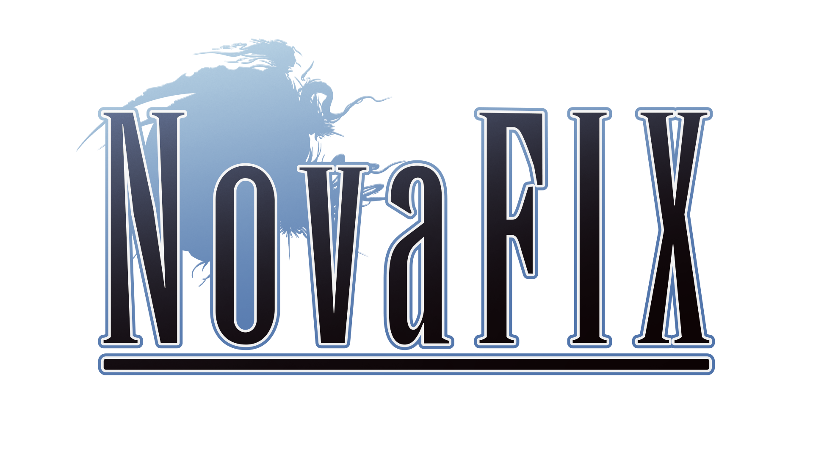

<p align="center">
  
</p>


Proxy for the PC versions of Final Fantasy XIII,
Final Fantasy XIII-2, and Lightning Returns

It fixes port-specific bugs, improves high-FPS behavior, expands graphics and
input options, and restores several features missing from Lightning Returns

Check [here](docs/HOOKS_AND_PATCHES.md) for imported functions,
vtable hooks, and executable patch locations.
[And the API info is here](docs/PLUGIN_API.md).


>For the best experience, use the [Nova Crystalia mod loader](https://github.com/LR-Research-Team/Datalog/wiki/%5BGUIDE%5D-Installing-mods-for-Nova-Chrysalia)
from the [official Discord server](https://discord.gg/mvqaETHjbh) to patch the game.
It also applies the 4 GB patch.


## Features

> [!NOTE]
> All settings available in the official launcher are also available in the in-game menu.
> The list below only covers added features.


**All games**

- Automatic keyboard/controller prompt switching
- Fast controller reconnect and XInput vibration
- Correct facial animations at high frame rates

**XIII and XIII-2**

- Borderless and borderless-fullscreen modes
- Proper monitor selection
- VSync, refresh rate, triple buffering, and frame limiting
- Fixes UI clipping and alignment at resolutions above 720p
- Faster UI rendering and anisotropic filtering without affecting pixel-art/UI textures
- Fixes occasional bad frames during hard scene cuts

**XIII**

- Fixes field movement and Titan's route at high frame rates
- Prevents the Nautilus cutscene crash at uncommon output resolutions

**XIII-2**

- High-FPS fixes for simulation timing, root motion, chain updates, and model initialization
- Fixes the one-pixel HUD sampling error above 720p
- Restores alpha-tested shadow detail
- Optional faster shadow rendering
- Mip LOD bias control
- Automatic QTE prompt switching
- Fixes Steam Cloud save crashes
- Fixes D3D9 resource-pointer crashes

**Lightning Returns**

- Removes the forced VSync cap
- Restores offline Snapshot mode with camera controls, HUD toggle, full-resolution PNG output, and Compose message editing
- Restores Schemata renaming
- Restores map-marker renaming
- Restores white-Chocobo renaming


## Installation

Only the latest Steam builds are supported. Microsoft Store releases are not
supported yet.

Copy `d3d9.dll` next to the game executable:

```text
XIII:   white_data/prog/win/bin/ffxiiiimg.exe
XIII-2: alba_data/prog/win/bin/ffxiii2img.exe
LR:     LRFF13.exe
```

> [!IMPORTANT]
> That's it - that's the whole installation.
>
> Don't combine it with FF13Fix or similar setups, it's not compatible.


Press `F10` in game to open the settings menu.


## DXVK and ReShade

Direct3D 9 works by default. On Linux, leave the renderer set
to `Automatic`, unless you want to use a local DXVK build ofc.

For DXVK on Windows, place the 32-bit `d3d9.dll` next to the proxy as `dxvk.dll`
and select `Local DXVK` under Performance / Advanced.

For ReShade, place its 32-bit D3D9 DLL next to the proxy as `ReShade32.dll` and
leave the renderer set to `Automatic`.


## Add-ons

The `addons` folder is not limited to add-ons made specifically for NovaFix.
Regular compatible 32-bit DLL/ASI mods can go there too, for example including things like
[XIII-2 Audio Fix](https://www.nexusmods.com/finalfantasyxiii2/mods/43) and
[Savior's Patch](https://www.nexusmods.com/lightningreturnsfinalfantasy13/mods/36).

If a mod comes as a DLL or ASI, putting it in `addons` is usually the safest
option. The filename does not matter, subdirectories work, and files are loaded
alphabetically, so prefixes such as `00_` and `10_` can be used to control load
order.


## Credits


---


NovaFix is unofficial and is not affiliated with or endorsed by Square Enix.
It does not include game files; a LEGAL installed copy of the game(s) is required.
